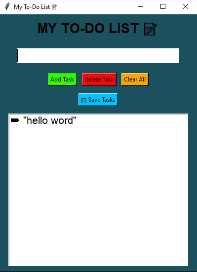
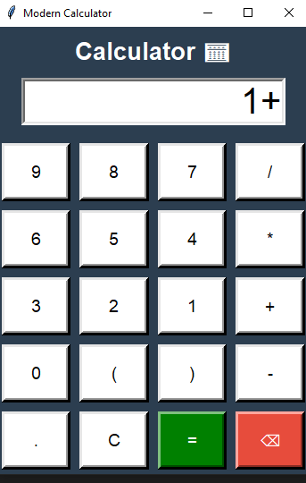
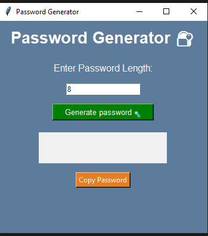
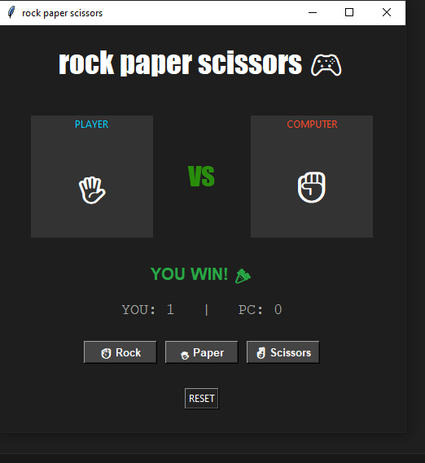
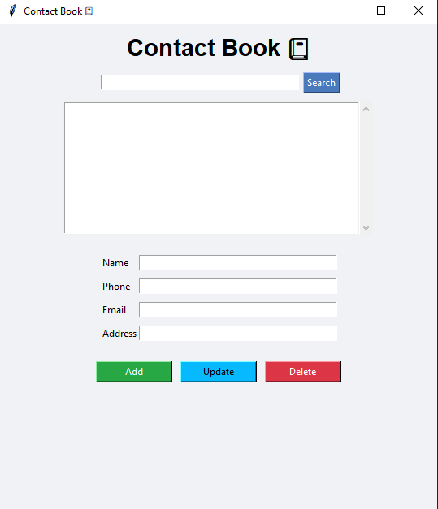

# CODSOFT Internship Projects

This repository contains all the tasks completed during the CODSOFT Tech Internship.  
All projects are built using **Python**.

## Projects
### 1. To-Do List 📝
A simple Python GUI program using **Tkinter** to manage tasks.  
- Add, delete,update,track and save tasks.

**Screenshot:**  

### 2. Calculator ➗
A basic Python calculator with GUI for simple arithmetic operations.  
- Addition, subtraction, multiplication, and division.
- Easy-to-use interface with Tkinter.

**Screenshot:**  

### 3. Password Generator 🔐
Generate strong and secure passwords with just a few clicks!  
- Custom password length.
- Mix of letters, numbers, and symbols.
- Copy password to clipboard easily.

**Screenshot:**  

### 4. Rock Paper Scissors Game ✂️
A Python Tkinter based game where the user plays Rock, Paper, Scissors against the computer.
Features:
- Score tracking
- Reset option
- Interactive GUI

**Screenshot:**  

### 5. Contact Book 📇
A GUI-based application built using Python and Tkinter to store and manage contacts.
- Add, search,update and delete contacts
- Store name, phone, email, and address
- Permanent file storage with auto-load feature

**Screenshot:**  

## Author
**Rishika Mali**  
